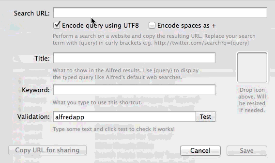

# Using Alfred in Mac
- Alfred is a better alternative for Spotlight app. 
- We can search any files and websites easily using Alfred.

- Snippets, workflows, and syncing are not available in free version.

- We can install Alfred 3 from [official website](https://www.alfredapp.com/).

- NOTE: Alfred costs 51 Dollars and is less powerful for snippets in comparison to aText (which is 5 Dollars). 
  In aText we can define key-values, define cursor positions, insert date etc commands.
  However, in Alfred we can use fields only for clipboard copies.
  
  To use clipboard copy we do not need to use Alfred, there is free mac app called `CopyClip`.
  
  Powerpack is not that useful unless we use workflows extensively.
  In free version of Alfred we can use websearch and file search like as Spotlight.

## Alfred Tips
1. Search a file in Alfred (eg. png) and press Shift key to see the quicklook.
2. Search png in alfred, go to a file press opt-uparrow, go to another png and opt-uparrow, then opt-rightarrow


## Some workflows Installations
1. [youtube-vlc-workflow](http://www.packal.org/workflow/alfred-youtube-vlc-workflow).
- Go to this [link](https://developers.google.com/youtube/v3/getting-started) and create a api key.
- Go to this [link](https://developers.google.com/youtube/v3/getting-started) and ENABLE the API.
- Type `yt video_name` in Alfred, then, enter will go there and `Cmd C` will copy the link of first option.


## Example of Alfred workflow
 


# Convert aText snippets to alfredsnippets
To convert a simple aText snippets in a csv format without special fields we can use the python script
`convert-aText-to-Alfred.py`.

If we have multiple `.csv` files without `whitespace` in thier names we can run following command:
```bash
# The python script: convert-aText-to-Alfred.py can be used to change aText csv snippet to alfredsnippets file.
# Python dependencies:
# pip install click json zipfile csv tempfile
for f in *csv; do python convert-aText-to-Alfred.py $f; done;
mkdir csvfiles; mv *.csv csvfiles
mkdir alfredsnippets; mv *.alfredsnippets alfredsnippets
```
