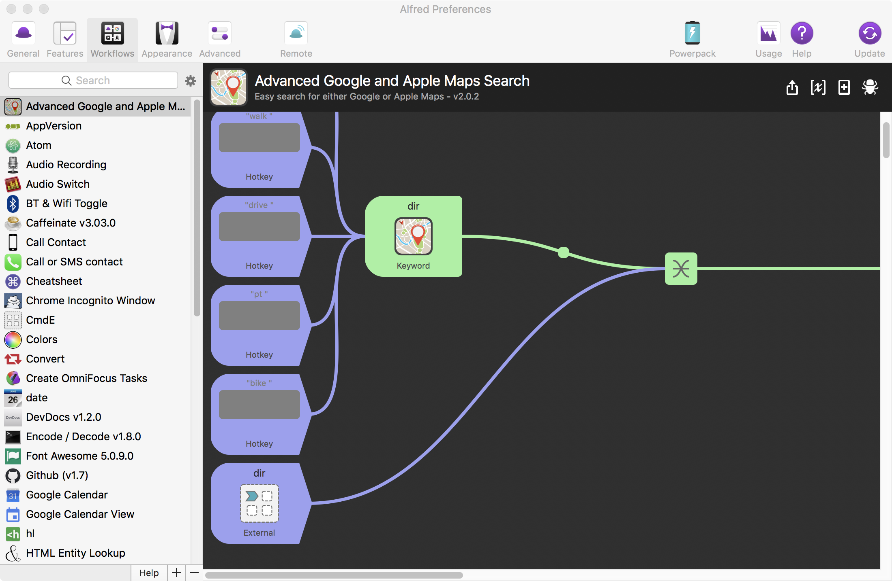

<!-- #===============================* -->
<!-- # Author: Bhishan Poudel
<!-- # Date  : Apr 9, 2018
<!-- #===============================* -->
#  Some useful alfred workflows.

1. advanced-google-maps-alfred-workflow

Usage: drive here to Columbus
 

2. AppVersion
Usage: av

3. Audio Recording
Usage: record audio

4. Audio Switch
Usage: input or output

5. BT & Wifi Toggle
Usage: bt or wifi

6. Caffeinate
Usage: caff

8. Call or SMS contact
Usage: call Somebody or sms somebody

9. Chrome Incognito Window
Usage: first open the chrome, incog

10. CmdE
Setup: go to the workflow and set Hotkey cmd E
Usage: hit cmd E      will open new finder window.

11. Colors 
Usage: hsl or rgb or # or   etc will show the colors

12. Convert
Usage: conv 1 ft cm
Usage: convinfo   will open [info page](https://github.com/deanishe/alfred-convert#alfred-convert) on browser.
Usage: hitting cmd or cmd-c will copy the answer

13. Encode / Decode
Usage: encode &   will give html symbol for ampersand

14. fkill
Link: [link](https://github.com/SamVerschueren/alfred-fkill)
Usage: kill atom  will force kill atom

15. Font Awesome
Usage: fa right arrow   will give the html coding for that thing

16. Git
Setup: TODO
Usage:

17.  Google calender view
Link: [link](https://github.com/deanishe/alfred-gcal)	
Usage: gal

18. hl    # highlight
Usage: Copy some text, hl python     will make it rtf, then past at mail.app

19. HTML Entity Lookup
Usage: el <=      will give the html code for this.

20. IncognitoClone
Link: [link](https://github.com/vitorgalvao/alfred-workflows/tree/master/IncognitoClone)
Usage: go to a tab in chrome, ic    will open that tab in incognito window

21. IP Address
Usage: ip

22. Kill Process
Usage: 

23. LabelColor
Setup: Hotkey cmd shf l
Usage: select a file or folder in finder, cmd shf l

24: 
Usage:

25:
Usage:

26: 
Usage: 

27: 
Usage:

28:
Usage:

29: 
Usage:

30: 
Usage:

31:
Usage:

32: 
Usage:

33: 
Usage:

34:
Usage:

35: 
Usage:

36: 
Usage:

37:
Usage:

38: 
Usage:

39: 
Usage:

40:
Usage:

41: 
Usage:

42: 
Usage:

43:
Usage:

44: 
Usage:

45: 
Usage:

46:
Usage:

47: 
Usage:

48: 
Usage:

49:
Usage:

50: 
Usage:

51: 
Usage:

52:
Usage:

53: 
Usage:

## Images
  
   
