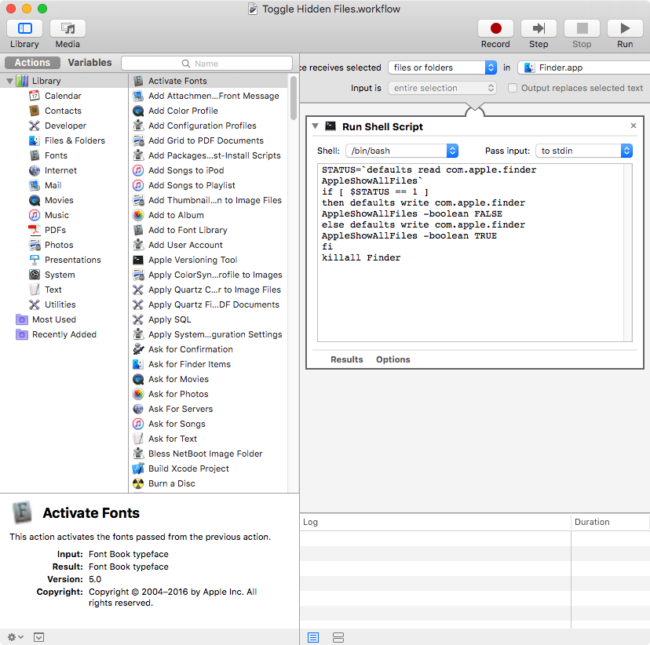

# This is a collections of services for MacOS.

## 1. Toggle Hidden Files
```bash
STATUS=`defaults read com.apple.finder AppleShowAllFiles`
if [ $STATUS == 1 ]
then defaults write com.apple.finder AppleShowAllFiles -boolean FALSE
else defaults write com.apple.finder AppleShowAllFiles -boolean TRUE
fi
killall Finder

```
 

## 2. 
