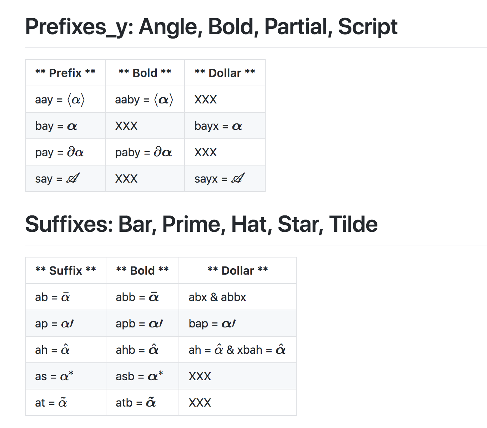

<!-- #===============================* -->
<!-- # Author: Bhishan Poudel
<!-- # Date  : Apr 3, 2018
<!-- #===============================* -->
# Comparison of browsers in Mac

- Chrome supports MathJax add-on, however, firefox does not.

## Math is rendered in Chrome via mathjax add-on

## Math is not rendered in Firefox.  

