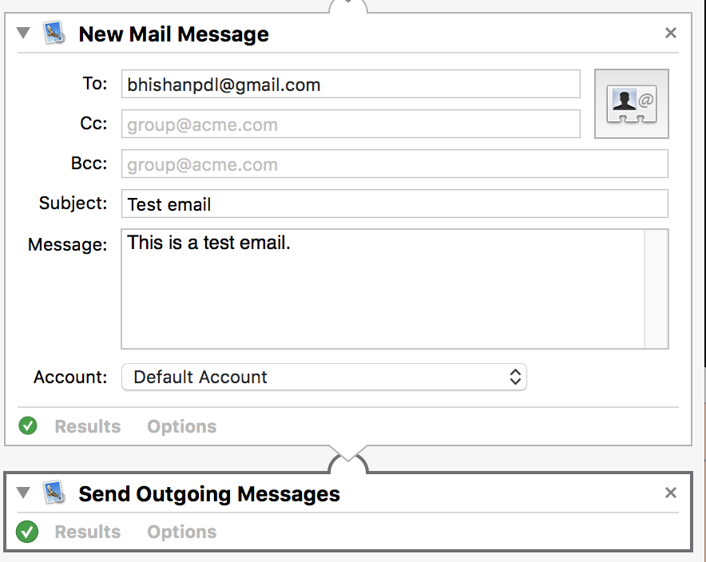
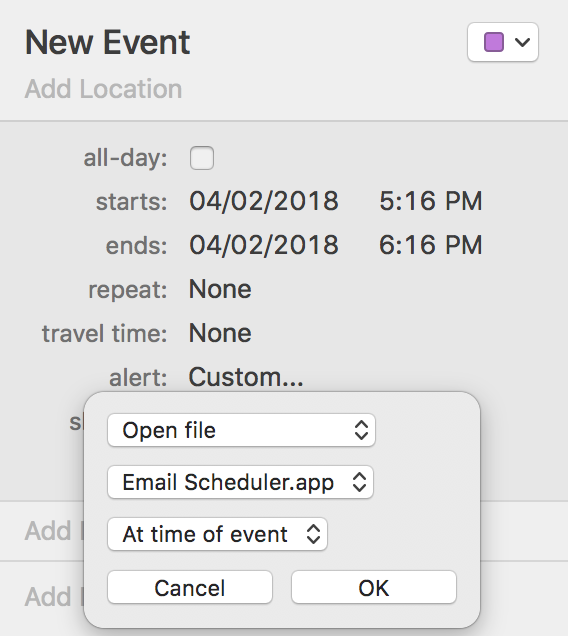

# Using Mail app and emails in Mac

## To send email via terminal
```bash
man mail
echo 'This is a test mail' | mail someone@email.com
```

## Keep a reminder to reply an email
Go to mail app and drag the email to Reminders app.

## Send email at a specific time
First create a application called `~/Applications/Email Scheduler.app` using automator.  
Then, Use this as file in Calender day event as `alert > custom`


