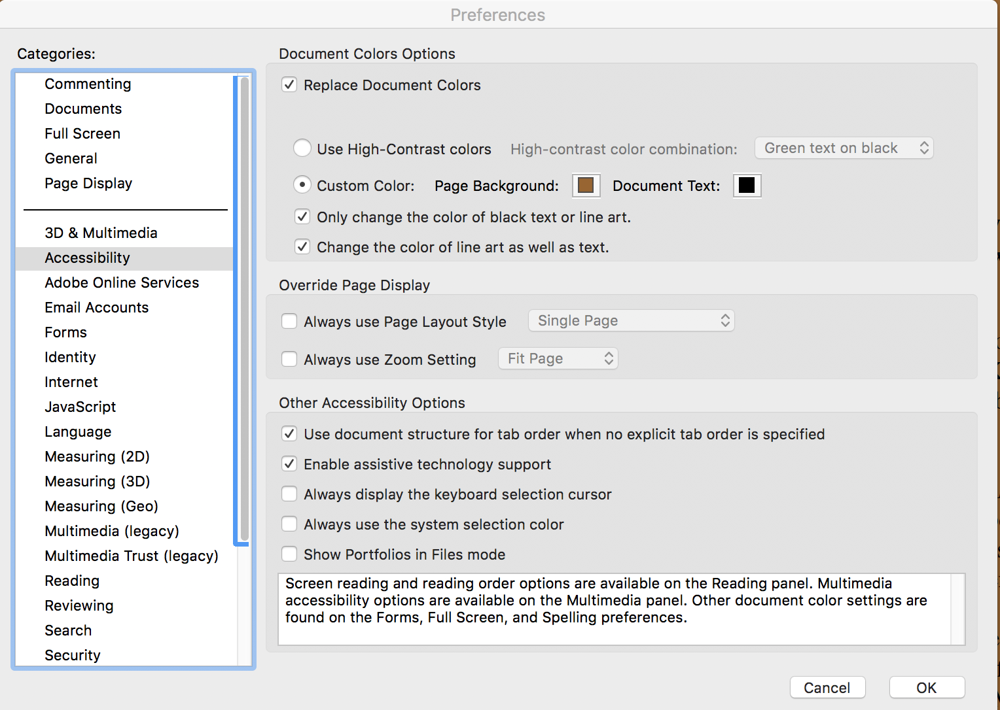

<!-- #===============================* -->
<!-- # Author: Bhishan Poudel
<!-- # Date  : Apr 3, 2018
<!-- #===============================* -->
# Using pdf documents in Mac

Use adobe reader and make the dark theme `Preferences > Accessibility > check on Replace Text`.
 
