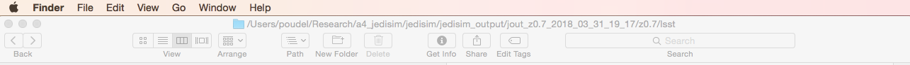

# MacApps
This repo contains settings and applications for my MacBook Pro and office iMacs.

### Apps for mac
- NEVER download XQuartz (it harmed my dmstack), install xcode using atom, when installing atom, it installs xcode.
- CopyClip, Alfred, Slack
- App Cleaner & Uninstaller
- Slack, Zotero, DS9, 
- hff5-view and fv-viewer (These gave problem with dmstack on pisces)
- OneDrive, Google Drive, Dropbox, [pCloud][pcloud]
-  Dr. Cleaner, Battery Monitor, DjVu Reader

### QuickLook Plugins
- Collections of useful quick look plugins are given [here](https://github.com/sindresorhus/quick-look-plugins).
- Detail list of quick look plugins are given [here](http://www.quicklookplugins.com/).
- To look fitsfile we can use [QLfits](https://github.com/onekiloparsec/QLFits).
- [Rest Plugin](https://github.com/cluther/qlrest) does not work in MacOS High Sierra. It does not do anything.

### Format markdown in Mail etc
- Install this [Multimarkdown Installer](http://brettterpstra.com/2013/03/08/new-in-the-markdown-service-tools-in-place-markdown-to-rtf/).
- Copy these [Service Scripts](http://brettterpstra.com/projects/markdown-service-tools/) to `~/Library/Services`.
- Usage: Right click and select echo hello in new email. Right click, go to Services and convert markdown to rtf.


### Alfred
I have saved web search customization in a textfile.

## Show full path in Finder
- To see full path at bottom: `View > Show Path Bar`
- To see full path name at top: `defaults write com.apple.finder _FXShowPosixPathInTitle -bool true; killall Finder`

### Mac Settings
```
Terminal > Preferences # Red sands, courier new 24, vertical bar, disable VT100 and disable bells, window check most, text
System Preferences > Keyboard > Shortcuts > Services
System Preferences > Users and Groups > Login Items
Finder > Preferences 
Finder > View > Customize Toolbar
Dock settings
Time (from toolbar) > Open Date time preferences

```

## Useful aliases and functions
```bash
# File: ~/.bash_profile
alias sb='source ~/.bash_profile'
export PS1='$(whoami)@${PWD/*\//}:' # change text color from terminal settings.
alias rm="echo Use 'del', or the full path i.e. '/bin/rm'"
function del () { mv  $@ ~/.Trash/; }
```

## Mac Malwares and Viruses
1. Epolife
2. Jimbre
3. Friendlysocket

## Add spaces to dock
```
# One execution of first line gives one space, we can move this space in the dock.
defaults write com.apple.dock persistent-apps -array-add '{tile-data={}; tile-type="spacer-tile";}'
killall Dock
```

## My customized finder


[pcloud]: https://www.pcloud.com/how-to-install-pcloud-drive-mac-os.html?download=mac
